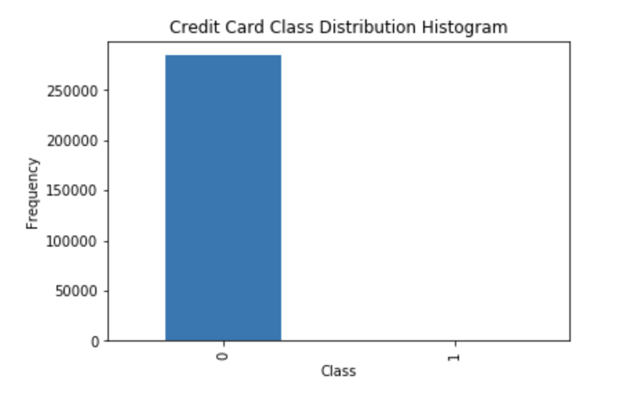
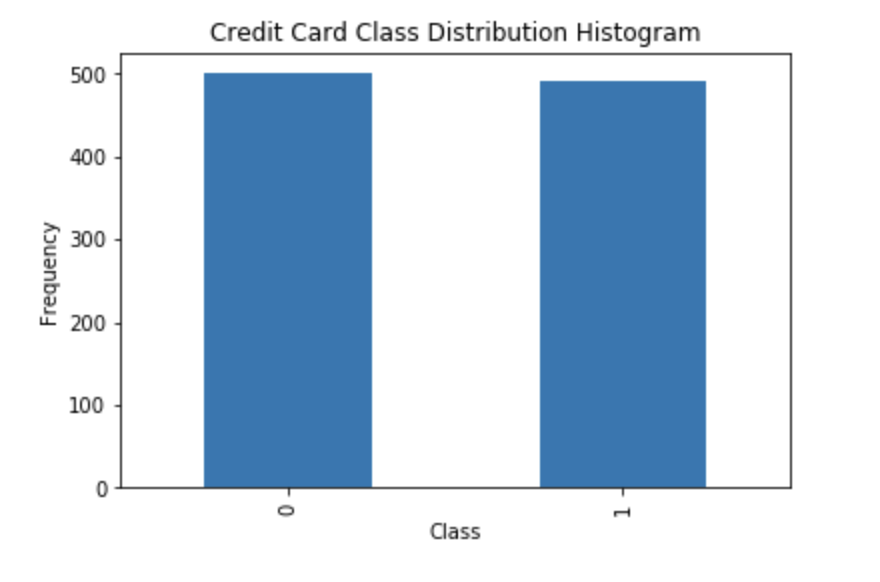
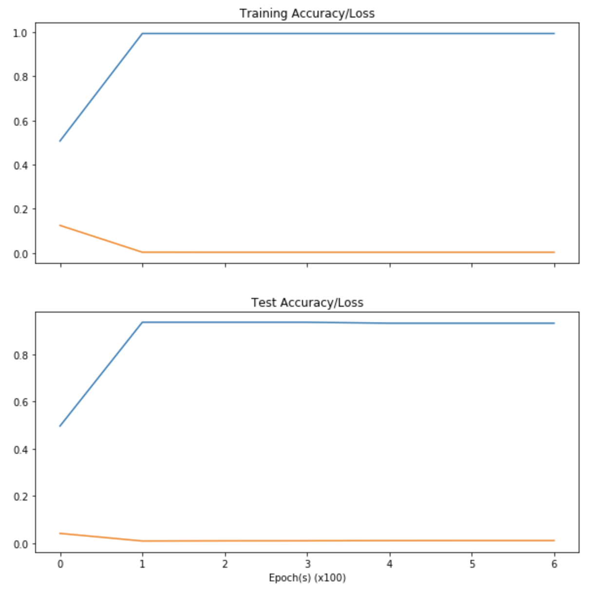
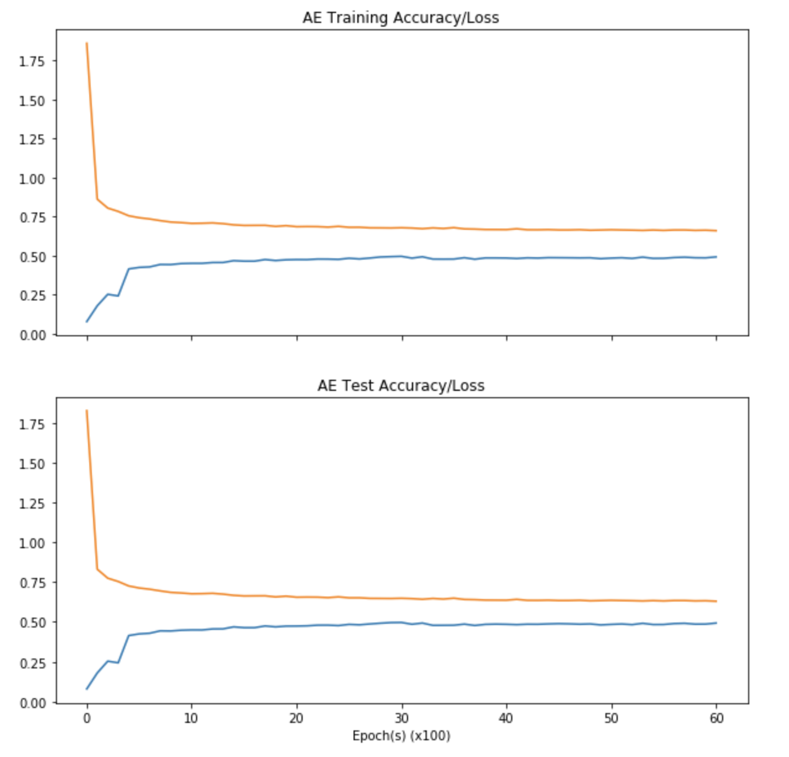

Chris Parsons - 11 January 2018

# Project Capstone
## Udacity Machine Learning Engineer Nanodegree



#Definition

##Project Overview

Credit Card Fraud is a serious problem! 

In order to improve the retail experience and ultimately to make more money, both credit card providers and retailers are striving to make the payment process as convenient and simple as possible. Since the 1980s these electronic payment systems have forged their way into our everyday lives. It is estimated that $31,000,000,000 of revenue was generated via these electronic payment systems worldwide in 2016. This represents a staggering 7.3% rise on the year before. <cite>[Nilson Report][1]</cite>

However, it's not all good news.. 

While these payment systems provide us with a simple, consumable and convenient payment platform they are also at risk to nefarious activities - including fraud. In a 5-year period from 2010-2015 fraudulent transactions on credit cards rose from $8,000,000 to $21,000,000. <cite>[BBC][2]</cite>  Not only does this impact consumers who will be hugely inconvenienced by having to report and rectify these errors, or worse be left out of pocket, but the retailers lose out too! If you're impacted by a fraudulent transaction on a particular website or in a store this hugely decreases the likelihood of you shopping there again. Steps must be taken to mitigate the impact of these transactions. 

So, what can be done to prevent this incredible growth in fraudulent transactions that hurts both consumers and retailers? 


## Problem Statement

There's certainly no shortage of data. From a financial services perspective we've got plenty of information about customers and their spending habits. There's everything, including transaction frequency and location to what kind of products you're likely to purchase. The problem is time! While it's possible to spot credit card fraud, given a team of experts and enough time, the challenge is that these transactions happen all over the globe, simultaneously, in the blink of an eye. 

So, given this abundance of data, and inherent time constraints affiliated with the domain - is it possible to build a system that will recognise fraudulent transactions on the fly, as these transactions take place? Wherever you are in the world? Such a system, if even only 75% accurate at detecting and halting fraudulent transactions before they complete would save the industry over 15,000,000 dollars annually! 

This is the challenge. Given historical information about fraudulent credit card transactions, can I train a system to be able to reliably detect new instances of fraud as they happen? 

### Datasets and Inputs 

The dataset being explored as part of this study can be found here. 
The "Credit Card Fraud" dataset contains transactions from two days in September 2013 made by European credit card holders. There are 284,807 transactions in total and 492 instances of fraud. Plainly this means I am working with a highly unbalanced dataset where the positive class accounts for ~0.2% of the overall dataset - which while representative of the real world, is not ideal for building a Machine Learning model. 

For confidentiality reasons the majority of the features have been transformed via PCA and only numerical values remain. Both 'Time' and 'Amount' features are not transformed. 


The label for each transaction can be found under the 'Class' feature and is coded as: 

 * Positive Class (1): Incident of fraud
 * Negative Class (0): Normal, not fraudulent, transaction 

**Note** The Credit Card Fraud dataset is available from [Kaggle](https://www.kaggle.com/dalpozz/creditcardfraud). 

### Solution Statement 

To solve the problem caused by credit card fraud, I will attempt to build a system that can automatically predict whether or not a transaction is fraudulent in real time. 

The core component of such a system will be a Machine Learning model that is capable of classifying credit card transactions as fraud or not fraud. This system will be trained on historical transaction data such that it is able to correctly determine whether a new transaction contains an instance of fraud. 

### Benchmark Model 

The simplest solution to this classification problem is to use a Logistic Regression classifier. This classifier will form the benchmark model for comparison. The success of this benchmark model can be determined by examining the accuracy when classifying against a known standard, or test set. 

This accuracy rating for the trivial Logistic Regression solution can then be used to evaluate the performance of subsequent models developed as part of this project. 

### Metrics

In order to successfully evaluate the performance of both the benchmark model and any subsequent more complicated approaches I will assess the accuracy of the model. Concretely, I will evaluate the model's precision and recall. 

This will examine two things: 

1. What percentage of the transactions labelled as fraud by the model were indeed fraud. 
2. What percentage of the transactions labelled as fraud were detected by the model. 


Computing these metrics allows me to make inferences about the suitability of each of the models developed. 

A detailed discussion of the performance metrics can be found [here](http://www.flinders.edu.au/science_engineering/fms/School-CSEM/publications/tech_reps-research_artfcts/TRRA_2007.pdf)
 
### Project Design 

This section describes the workflow for the project.
 
#### Programming Languages and Tooling 

1. **Python 2.7** - I have elected to use Python as a programming language for this project primarily because of its ubiquity within the Data Science space and subsequent documentation. Python is also ideal for this use case because of the way the language interprets and handles large numbers which are abundant in this dataset. 
2.	**Jupyter Notebooks** - These notebooks provide a suitable platform for developing the model and documenting the workflow. Jupyter notebooks are great for demonstrating the underlying implementation of Machine Learning models which makes them ideally suited for use in this project. 
3.	**Scikit-Learn** - SKLearn is a Python-based Data Science library. The library comes with tools and functions that allow data manipulation and the implementation some simple Machine Learning models in a compact and consumable way. This library will prove invaluable in rapidly iterating on the design of the final system. 
4.	**Keras** - Keras provides a 'High Level Neural Network API'. Such an abstraction will vastly improve the development workflow when examining the suitability of Neural Networks when applied to this problem domain. 
5.	**TensorFlow** - This open source Machine Learning and deep learning framework delivers the back end functionality to Keras, in a sense TensorFlow does all the heavy lifting and number crunching of the Keras model definition.


#### Model Implementation 

1. **Benchmark Model** - The benchmark model will be a Logistic Regression Classifier. This model will be implemented using the tooling in SKLearn and be used to compare all other models developed as part of this project. 
2.	**Complex Model** - I will then explore how using models like SVM or xgboost perform when applied to this binary classification problem. 
3.	**Neural Network** - In order to examine the effectiveness of complex solutions on this non-image domain I will develop a Neural Network architecture that is capable of classifying the instances of fraud. Subsequent analysis of the accuracy of the Neural Network architecture will allow direct comparison between complex and simple techniques in this problem space. 
4.	**AutoEncoding** - Finally, in order to mitigate issues with the Credit Card Fraud dataset that I observed during this project I'll explore how AutoEncoders and Unsupervised learning can be applied to this domain. 



## Analysis

### Importing the Data

In order to begin working with the Credit Card Fraud data, I first needed to import the required functionality and load the .csv data into a pandas DataFrame. 

From this subset of the Credit Card transaction data, we can see various features for each transaction in the dataset:

* Class: The class label for the datapoint. Positive class (1) indicates an incident of credit card fraud and the Negative Class (0) is not an instance of fraud.
* Time: The time in seconds between each transaction.
* V1 - V28: Due to the sensitive nature of financial information it is not possible to know specifics about each of the features in this dataset. However, we do know that the data itself has been cleaned of extraneous values and has undergone Principle Component Analysis (PCA).
* Amount: The amount of the transaction.


### Examining the Data

In order to ensure the validity of any models produced, it is important to have a thorough understanding of the dataset itself. With Supervised Learning, specifically binary classification problems such as this, the distribution of samples in both positive and negative classes is pivotal. 

This histogram clearly demonstrates that with this particular dataset, pertaining to credit card fraud, there is an inbalance between the classes. Concretely we have significantly more negative samples, or not fraud, than we do examples of fraud. This is not entirely unexpected as the data contains all credit card transactions for a 24h period - however the disparity between the class distribution could skew results. For instance, a model that simply predicted nothing as fraud would be 99% accurate!!!



The positive 'fraud' class makes up ~0.17% of the raw data. Before attempting to model the data in any way - it's important to have a more balanced ratio between the classes. There are several ways of doing this:
* Collect more data for the positive class
* Undersample the negative class
* Changing the performance metric
* Oversample the positive class

As I've discussed previously, Financial Services data is difficult to come by so the notion of growing my dataset is not feasible within the scope of this project. In order to reduce the risk of potential overfitting I will reduce the number of samples in the negative class. I will collect a random selection of negative, not fraud, samples and attempt to balance the ratio of positive/negative samples.

However, this process would induce an error in the dataset. The 'Time' feature 
tells me the number of elapsed seconds between transactions, when I randomly remove some of the samples this value will no longer be correct. In order to mitigate this, I can simply exclude the 'Time' feature from the dataset used for testing.

I also observed that the 'Amount' feature was not normalised - I scaled this feature in the new dataset to mitigate any issue arising from the scale of the Amount feature.



After the undersampling of the raw data I had a much more even distribution of both classes, which is clearly illustrated by the above histogram. The dataset now has 992 samples, as opposed to the original 30k from the raw data. The distribution is not exactly 50:50 between both classes, there are 492 instances of fraud (the entire positive class from the original dataset) and 500 randomly selected rows from the negative class.

It was important to ensure that the rows were selected at random to eliminate any potential experimenter bias.

### Modelling the Data

At this point I had read the data into a DataFrame, defined a function for computing the accuracy of the model and balanced the class distribution. It was time to start modelling the data. The first technique I used is SKLearn's LogisticRegression classifier. This model will serve as a benchmark for the more complicated models I explore later in this study.

Logistic Regression refers to a classifier that classifies an observation into one of two classes, such as fraud/non fraud. Unlike Naive Bayes, Logisitc Regression classifiers do not depend on the input features being correlated. As the dataset has undergone PCA previously, and we do not know much about the various features, the Logistic Regression classifier is ideally suited to serve as a benchmark model in this case. 

The code cell below shows how I defined the LogisticRegression classifier and reported its accuracy.

```
from sklearn.cross_validation import train_test_split
from sklearn.linear_model import LogisticRegression

# Split the data into training and testing sets using the given feature as the target
X_train, X_test, y_train, y_test = train_test_split(small_data_features, small_data_labels, test_size=0.25, random_state=42)

# Create a logistic regression classifier and fit it to the training set
bmark_clf = LogisticRegression(random_state=5)
bmark_clf.fit(X_train, y_train)

# Report the score of the prediction using the testing set
y_pred = bmark_clf.predict(X_test)
score = accuracy(y_test, y_pred)

print(score)

```

The benchmark model reported an FScore (accuracy) of 0.94. This acted as a reference point/standard to compare all other techniques against. I think the fact that the LogisticRegression classifier performed so well in this instance is testament to the PCA conducted on the dataset.

## Methodology

### SVM

The next model I tested was the SVM classifier in SKLearn. An SVM model represents the examples as points in space. These points are then mapped so that examples from both classes (positive/negative, fraud/not fraud) are divided by a clear gap and the margin is maximised. New samples are then mapped into the same plane and a classification is made based on which side of the boundary they fall. SVMs are 'non-probabilistic binary linear classifiers' and thus I would expect them to perform well for this use case.
The code cell below trains an SVM for the Credit Card fraud data and then analyses the model's performance.

SVMs can be used for regression or classification tasks. The model itself performs an operation known as the "Kernel Trick" to perform a transformation of the input data before finding an optimal decision boundry between the possible classes. The beneift of this technique is that it is possible to capture significantly more complicated relationships within the data without performing, potentially difficult, transform operations manually. 

However SVM classifiers are significantly more computationally intensive to train and take up a larger memory footprint than other forms of classifiers. 

The SVM classifier I used in this experiment was defined as: 

```
from sklearn.svm import SVC

# Create a logistic regression classifier and fit it to the training set
svc_clf = SVC()
svc_clf.fit(X_train, y_train)

# Report the score of the prediction using the testing set
y_pred = svc_clf.predict(X_test)
score = accuracy(y_test, y_pred)

print(score)

```
#### Evaluating the Model

`Precision: 0.96, Recall: 0.91, Fscore: 0.93`

##### Comparison to Benchmark

The SVM model actually performed less well than the LogisticRegression classifier for this dataset. The SVM model was not able to detect as many instances of fraud as the benchmark. In the benchmark test, 94% of fraud cases were classified correctly. The SVM recalled ~2% less than this - making it less effective. 

##### Comments

In practice, SVMs and Logistic Regression's perform comparably. The performance of the SVM shows that the data is linearly separable, and there are no significant outliers skewing the model. 

The SVM algorithm implemented in SKLearn is based on libsvm. This technique is significantly more 'geometrically motivated' than the benchmark model. The goal here is not to define a probabilistic model, but to find an optimal separating hyperplane. The fact that we are seeing similar results between this and the benchmark simply indicates that the Logistic Regression is performing well and producing a 'wide margin' classifier, which is the goal of the SVM.

In short, the SVM seeks to find a decision boundry as far as possible from all known points while the LogisticRegression classifier is meerly seeking an optimum boundry, even if this lies close to some of the datapoints. 

### Neural Network

In order to measure the performance of more complicated technique on automatically determining Credit Card Fraud I then defined a Neural Network architecture. This allowed me to compare NN Architectures against more "simple" techniques for binary classification tasks. 

Neural Networks are extremely flexible and can be used for classification and regression problems. They model data with a large number of features effectively by splitting the classification task into a layered "network" of smaller components. 

The task of inferencing, that is to say predicting the class of unknown data, is relatively fast for a well constructed Neural Network. 

When considering the best approaches to build a Fraud Detection model I considered the environment a production system would need to operate in. Financial Services data consists of a huge number of input features, which Neural Networks are adept at handling. The model also needs to perform inferencing operations in real time. Credit Card transactions typically occur in a fraction of a second, to be deployed in the real world the model can't add any latency to this operation without significantly impacting the end user experience. 

The code cell below defines the network itself.

```
import tensorflow as tf
sess = tf.Session()

# Convert DataFrames to Matricies for TF
trainX = X_train.as_matrix()
trainY = y_train.as_matrix()
testX = X_test.as_matrix()
testY = y_test.as_matrix()

# Reshape Labels
trainYShape = trainY.shape
trainY = trainY.reshape(trainYShape[0], 1)
trainY = np.concatenate((1-trainY, trainY), axis=1)
testYShape = testY.shape
testY = testY.reshape(testYShape[0], 1)
testY = np.concatenate((1-testY, testY), axis=1)\n

# Multiplier maintains fixed ratio of nodes between each layer
mulitplier = 1.5 

# Number of nodes in hidden layer 1
hidden_nodes1 = 15
hidden_nodes2 = round(hidden_nodes1 * mulitplier)
hidden_nodes3 = round(hidden_nodes2 * mulitplier)

# Input (features from dataset)
X_ = tf.placeholder(tf.float32, [None, 29]) 

# Layer 1
W1 = tf.Variable(tf.zeros([29, hidden_nodes1]))
b1 = tf.Variable(tf.zeros([hidden_nodes1]))
y1 = tf.nn.sigmoid(tf.matmul(X_, W1) + b1)

# Layer 2
W2 = tf.Variable(tf.zeros([hidden_nodes1, hidden_nodes2]))
b2 = tf.Variable(tf.zeros([hidden_nodes2]))
y2 = tf.nn.sigmoid(tf.matmul(y1, W2) + b2)

# Layer 3
W3 = tf.Variable(tf.zeros([hidden_nodes2, hidden_nodes3])) 
b3 = tf.Variable(tf.zeros([hidden_nodes3]))
y3 = tf.nn.sigmoid(tf.matmul(y2, W3) + b3)

# Layer 4
W4 = tf.Variable(tf.zeros([hidden_nodes3, 2])) 
b4 = tf.Variable(tf.zeros([2]))
y4 = tf.nn.softmax(tf.matmul(y3, W4) + b4)

# Output (classification) layer
y = y4
y_ = tf.placeholder(tf.float32, [None,2])

```
The hyperparameters I used for training the model were: 

1. learning_rate = 0.001
2. training_epochs = 30000 
3. display_step = 5000
4. batch_size = trainY.size

I elected to use TensorFlow's AdamOptimiser for the cost function. This is because the AdamOptimizer will automatically control the learning rate, in effect having a larger step size at each epoch and causing convergence more quickly. As the Adam algorithm determines this step size automatically, this convergence can be achieved without fine tuning which makes the Adam Optimizer ideal for this experiment.

The downside to this is that the Adam algorithm will require more computation for each parameter at every epoch so that the moving averages and scaled gradient can be calculated. This will cause an increase in the training time! The model itself will also be ~3x larger than one created using the tf.train.GradientDescentOptimizer.

I also used a mean squared error loss function. While classically Cross-Entropy would be preferred over MSE for classification challenges such as this, I felt that due to the performance of the linear classifiers in earlier tests MSE will perform equally well in this case as it is ideally suited to regression problems.

#### Evaluating the Model

`Training Step: 30000  Test Accuracy =  0.931452 Test Loss = 0.011311`

##### Comparison to Benchmark

Without any hyperparameter optimisation the Neural Network Model achieved a 90% accuracy for the input dataset. In order to gain a better intuition of what is happening during the training phase, I visualised the learning rate and cost for each epoch. 



Interestingly the benchmark model and Neural Network actually performed equivalently for this dataset. Both models were able to predict the instances of fraud in the test set with ~94% accuracy. I think this result illustrates two points:

1. That Neural Networks perform well in comparison to more basic models for a variety of workloads
2. The Credit Card Fraud dataset used in this experiment is clearly linearly separable. Thus LogisticRegression/other linear classifiers will perform extraordinarily well. This would not be the case if the dataset was less linearly separable. 

I think it is also important to note that this is a very simple Neural Network implementation, it would be possible to further optimise this network with hyperparamter tuning/more hidden layers. 

##### Comments

The visualisations above show that for both our training and test datasets the Neural Network improved considerably over the training iterations. Being able to visualise both the training/test loss in this way is a powerful tool as it allows us to concretely identify instances of overfitting. As the system is performing equally well for both datasets we can infer that the Neural Network model has not over fitted the data and has the ability to generalise well. 

It is also clear from these visualisations that the Neural Network plateaued at ~93% accuracy for both training and test datasets. In order to further improve the accuracy we would need to change the network definition or modify the hyperparameters/loss function. 

### AutoEncoding

To conclude this report I explored how AutoEncoders can be used to define Neural Networks capable of identifying credit card fraud. My original intention was to apply Transfer Learning of an existing Neural Network definition to this problem and evaluate its performance - however after conducting this work, and gaining a better understanding of the dataset I feel that using AutoEncoders is a better academic discussion. 

What makes AutoEncoders so interesting is that they are an instance of ** Unsupervised Learning **. Unlike all of the other methods discussed previously, this technique does not require a subset of labelled data. When you consider the wider domain problem, that is to detect fraud at enterprise scale, not having the prerequisite of labelling your existing dataset to identify the model is a really powerful tool. 

Because we are now working with unlabelled data, I reverted to use the unbalanced dataset from the raw data but without the label that classifies the dataset. The model is then trained with the assertion that no such labels exist for the data. 

So what are AutoEncoders? 

An autoencoder, which can sometimes be referred to as an autoassociator or Diabolo network, is an Artificial Neural Network which can be used for unsupervised learning. This technique aims to learn an encoding for a set of data. The simplest architecture for an autoencoder is a feedforward non-recurrent neural network. This network has an input layer, output layer and N hidden layers connecting these two. The output layer has the same number of nodes as the input layer with the purpose of redeveloping its own inputs as opposed to predicting the target value. 


Some typical use cases of AutoEncoders include: 

* Data Denoising - reducing the amount of noise/error in an image for example. 
* Dimensionality Reduction - for instance in this example, where we look to perform feature extraction and reduce the number of input features to make understanding the data a less complex task. 
* VAE (Variational AutoEncoders) - Here we learn the parameters of the probability distribution by modelling the input data as opposed to learning some function (as is the case with traditional AutoEncoders) 


How does it work? 

I built an AutoEncoder to 'learn' the common/frequent patterns that are shared by the significant proportion of the training data. The Root Mean Squared Error will be large for the data that does not conform to these patterns. It's this step that is ideal for our use case, we have a large amount of 'not fraud' data which we will use to build a pattern of the 'normal' and anything that lies outside that will have a large RMSE which we can use to infer that these points are 'fraud' or examples of the positive class. 

There are two approaches: 

1. We select a threshold for the error and assume everything over a certain value is fraud
2. We rank all the RMSE values and take the largest (say 0.17%) and state that these are fraudulent

I appreciate I'm cheating a little bit with point two because I know that 0.17% of my dataset is fraudulent. However, it would be possible to narrow down on this value in the real world via repetition. 


#### Building The Dataset

As discussed, we need to work with the whole dataset for this technique minus the label. In the code cell below I normalise the Amount value and remove the label so we're working with an instance of unsupervised learning. 

`The dataset contains 284807 samples. `

The `ae_data` dataset includes all the rows from the raw data without the "Class" feature. As before I normalised the Amount column for consistency. I then performed a train/test split on the data (reserving 25% for testing) in order to perform Cross Validation.  

#### Building the Model

The next step was to build the AutoEncoder itself. I defined the hyperparameters which, with the exception of the learning rate, were the same as the pervious TensorFlow experiment. I then defined the network parameters, specifying the number of features in the hidden layers and the feature dimension. The code used to define the AutoEncoder can be seen below: 

```
# Hyperparameters 
learning_rate = 0.01
training_epochs = 30000
display_step = 500

# Network Parameters
n_hidden_1 = 15 
n_hidden_2 = 5 
n_input = X_train_ae.shape[1]  
X_ = tf.placeholder("float", [None, n_input])
 
weights = {
    'encoder_h1': tf.Variable(tf.random_normal([n_input, n_hidden_1])),
    'encoder_h2': tf.Variable(tf.random_normal([n_hidden_1, n_hidden_2])),
    'decoder_h1': tf.Variable(tf.random_normal([n_hidden_2, n_hidden_1])),
    'decoder_h2': tf.Variable(tf.random_normal([n_hidden_1, n_input])),
}
biases = {
    'encoder_b1': tf.Variable(tf.random_normal([n_hidden_1])),
    'encoder_b2': tf.Variable(tf.random_normal([n_hidden_2])),
    'decoder_b1': tf.Variable(tf.random_normal([n_hidden_1])),
    'decoder_b2': tf.Variable(tf.random_normal([n_input])),
}
 
# Encoder
def encoder(x):
    # Encoder Hidden layer with tanh activation #1
    layer_1 = tf.nn.tanh(tf.add(tf.matmul(x, weights['encoder_h1']),
              biases['encoder_b1']))
    # Decoder Hidden layer with tanh activation #2
    layer_2 = tf.nn.tanh(tf.add(tf.matmul(layer_1, weights['encoder_h2']),
              biases['encoder_b2']))
    return layer_2
 
# Decoder
def decoder(x):
    # Encoder Hidden layer with tanh activation #1
    layer_1 = tf.nn.tanh(tf.add(tf.matmul(x, weights['decoder_h1']),
            biases['decoder_b1']))
    # Decoder Hidden layer with tanh activation #2
    layer_2 = tf.nn.tanh(tf.add(tf.matmul(layer_1, weights['decoder_h2']),
            biases['decoder_b2']))
    return layer_2
 
# Construct model
encoder_op = encoder(X_)
decoder_op = decoder(encoder_op)
 
# Prediction
y_pred_ae = decoder_op
y_true_ae = X_
 
# Measure model accuracy
correct_prediction = tf.equal(tf.argmax(y_true_ae,1), tf.argmax(y_pred_ae,1))
accuracy = tf.reduce_mean(tf.cast(correct_prediction, tf.float32))

# Define loss and optimizer, minimize the squared error
cost = tf.reduce_mean(tf.pow(y_true_ae - y_pred_ae, 2))
optimizer = tf.train.RMSPropOptimizer(learning_rate).minimize(cost)


```

The variable X is the placeholder for the input data. The two Dictionaries (Weights, Biases) hold all of the parameters that will be optimised during the training phase. Each layer of the AutoEncoder uses a tanh activation function, this outputs values either side of 0 (between -1 and 1). 

Thus is ideally suited for this use case. 

As with the Neural Network experiment above I will use a Root Mean Squared Error (RMSE) cost function to optimise the parameters of the model. 

#### Evaluating the Model 

`The AutoEncoder achieved a maximum accuracy of 49.2612570524% on the validation dataset.`

##### Comparison to Benchmark




On the Credit Card Fraud dataset AutoEncoders did not perform as well as Neural Networks or the benchmark model. The AutoEncoder achieved an ultimate accuracy of 49.3% on the Test dataset. Unfortunately, many of the steps I would subsequently have taken to optimise this model cannot be done due to the feature engineering conducted on the dataset. With this in mind it is not possible to make an accurate inference about the applicability of AutoEncoders in this domain. In order to test this model more rigorously I could follow the following procedure: 

1. Collect more data (having more samples in the positive class would be beneficial)
2. Conduct feature engineering on the raw data. In order to improve the performance of the model I would like to conduct PCA/Feature Engineering on the raw data. However, as previously discussed, due to the nature of the domain this is not possible.
3. Hyperparameter optimisation/more hidden layers. 


##### Comments

The visualisations above show that for both our training and test datasets the AutoEncoder improved over the training iterations. Being able to visualise both the training/test loss in this way is a powerful tool as it allows us to concretely identify instances of overfitting. As the system is performing poorly both training and validation datasets we cannot infer whether or not AutoEncoders, and unsupervised learning, could be used to tackle this domain problem. 


## Results

### Conclusion

With this project I set out with the goal of determining whether or not it was possible to build a system using Machine Learning that could recognise and detect Credit Card fraud. While, as previously discussed, there were challenges with the dataset caused by privacy concerns, I feel that I have successfully demonstrated that it is indeed possible to build such a system.

I have used a variety of techniques, from simple LogisticRegression classifiers through to more complicated Neural Networks and AutoEncoders to build systems capable of detecting Credit Card Fraud. I have ranked the models in terms of accuracy here:

1. LogisitcRegression Classifier
2. Neural Network
3. SVM
4. AutoEncoder


The LogisticRegression classifier performed really well at this task, achieving an accuracy of 94%. This classifier was capable of detecting fraud in the validation dataset at a very high level of accuracy. This model shows that there is validity in persuing Machine Learning as a technique for identifying Credit Card fraud for the entire industry.

The fact that LogisticRegression classifier, and SVM performed so well also tells us interesting things about the underlying dataset. These techniques are extremely effective with linearly separable data. That is to say, it is possible to delineate both classes with a single boundary.

As a result of the composition of the dataset simple classifiers performed really well. I was also interested to see how well Neural Networks would manage a binary classification task. The NN Model achieved a relatively similar accuracy to the other classifiers. While it was more complicated to implement the Neural Network, it achieved a similar accuracy and would scale to more complicated problem domains should the data be available.

Unfortunately due to the dimensionality reduction already conducted on the dataset the AutoEncoder did not perform particularly well for this project. In order to improve the system I would need access to more data, and conduct PCA/analysis on the various features. I firmly believe this approach would be applicable to allow Financial Services organisations to leverage unsupervised learning to automatically detect Credit Card Fraud from unlabelled data. This would be extremely valuable because in the wild, the data itself is very much unlabelled.

### Improvements

In this project the dataset has already undergone Dimensionality Reduction, Feature Normalisation and PCA. In reality, Financial Services institutions do not hold their data in this processed format. In order to more accurately simulate the real world scenario I would require access to this raw data. Unfortunately (or fortunately) due to privacy concerns and legislation, it is not possible to observe this information in its raw form.

I would also have liked access to more datapoints in the Positive class. Only 0.17% of the data represents an instance of Fraud and this ultimately impacts the scalability and ecological validity of the model. As I had to significantly reduce the dataset size for this analysis there is a high chance of overfitting. If I were to repeat this study I would certainly seek a larger dataset.

When conducting the intiial exploration of the dataset I reported a clear imbalance between the positive and negative classes. While I discussed several ways of doing this, I did not explore oversampling. SMOTE (Synthetic Minority Over-Sampling) is one of several ways of oversampling a dataset for a binary classification task such as this. 

SMOTE works by taking the features of the minority class, in this case examples of fraud, and exploring the K nearest neighbours of this point. A vector is then taken from the current point and one of the K neighbours. This vector is then multiplied by a random number (between 0-1), the result of this operation is added to the value of the original datapoint to create a new value to be attributed to an additional instance of the minority class.

If I were to repeat this experiment - in order to obtain more accurate, reliable results I would oversample the positive class, thereby creating artificially more examples of fraud which could be used to train the model. 

More information on oversampling, and the tools that allow this technique to be implemented, can be found [here](http://contrib.scikit-learn.org/imbalanced-learn/stable/over_sampling.html). 

Finally, I have thoroughly enjoyed this project and the entire nanodegree program. It has given me a deep insight into Machine Learning, Deep Learning and the challenges faced by Data Scientists. :)

## Acknowledgements

* Andrea Dal Pozzolo, Olivier Caelen, Reid A. Johnson and Gianluca Bontempi. Calibrating Probability with Undersampling for Unbalanced Classification. In Symposium on Computational Intelligence and Data Mining (CIDM), IEEE, 2015

* Powers, David M W (2011). "Evaluation: From Precision, Recall and F-Measure to ROC, Informedness, Markedness & Correlation" (PDF). Journal of Machine Learning Technologies. 2 (1): 37–63.

[1]:https://www.nilsonreport.com/upload/content_promo/The_Nilson_Report_10-17-2016.pdf
[2]:http://www.bbc.com/capital/story/20170711-credit-card-fraud-what-you-need-to-know

